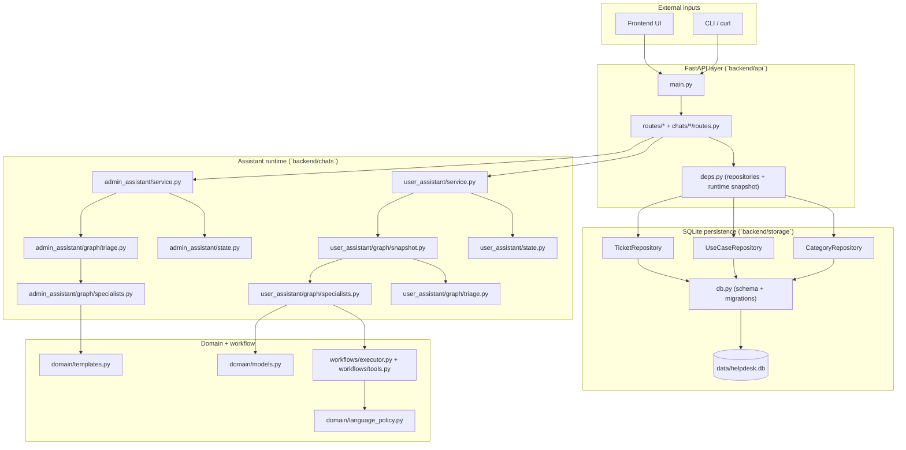
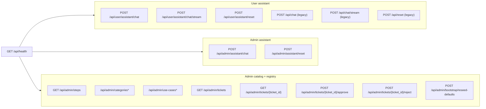
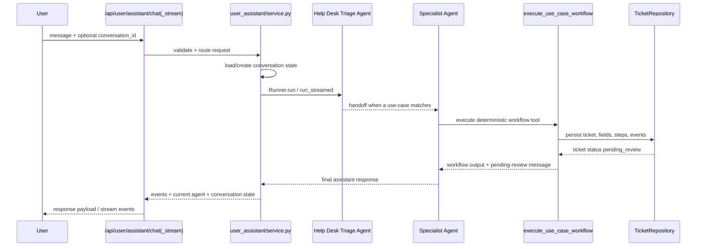
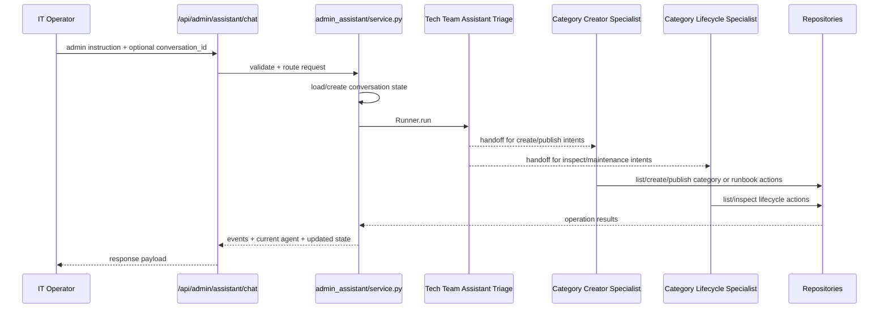
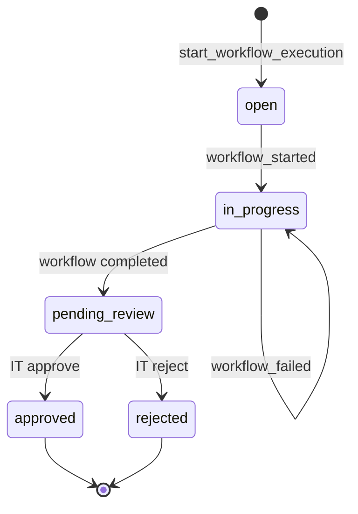
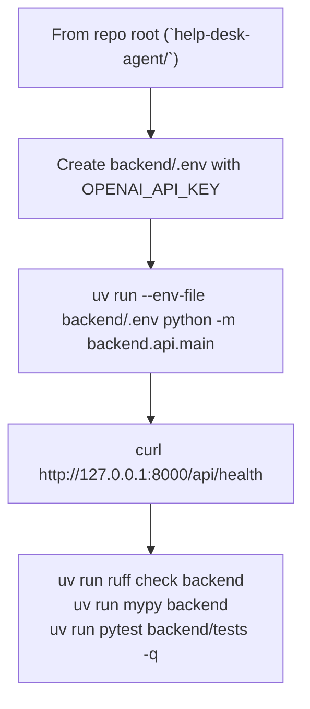

# Help Desk Backend

Backend reference rendered as Mermaid diagrams.

## System map

## API surface map

## User assistant interaction

## Admin assistant interaction

## Ticket lifecycle

## Run + validate

