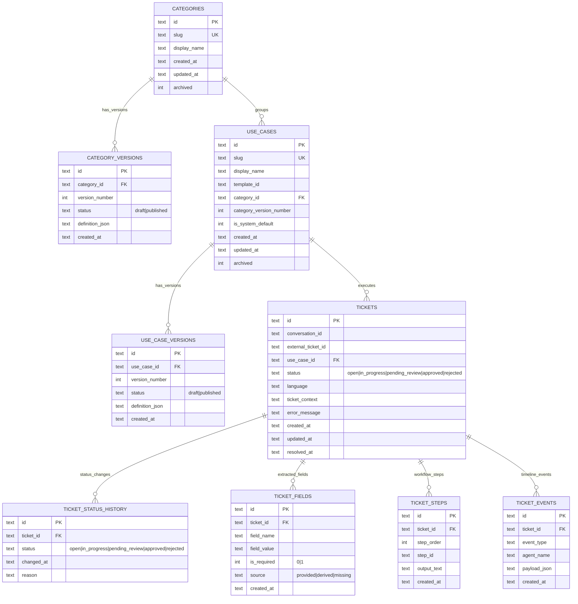

# Help Desk DB Schema

This schema combines category/use-case lifecycle tables with a normalized ticket registry.

## ER diagram

## Category vs Use Case

- `Category` (`categories` + `category_versions`): routing template and policy family. It defines the allowed deterministic step IDs and the default handoff/routing/required-field contract for a problem domain.
- `Use case` (`use_cases` + `use_case_versions`): concrete executable workflow in that category. It defines the exact ordered steps and required fields that specialist agents collect and execute.

In practice:

- Category answers: "What type of ticket is this and what workflow patterns are allowed?"
- Use case answers: "Which exact deterministic steps will run for this ticket?"

## Default Catalog (Case-Aligned)

| Case ID | Category slug | Default use-case slug | Pattern | Required fields |
| --- | --- | --- | --- | --- |
| `USDV-176285` | `access-reset` | `reset-acceso-ecrew` | eCrew login/access recovery | `ticket_id`, `requester_name`, `requester_id`, `affected_platforms` |
| `USDV-176893` | `employee-onboarding` | `alta-email-efos-pelesys` | Employee onboarding for E-MAIL/EFOS/PELESYS | `ticket_id`, `requester_name`, `employee_name`, `employee_batch`, `target_systems` |

## Ticket lifecycle

- Ticket row is created when deterministic workflow execution starts.
- Initial transitions are `open -> in_progress`.
- Successful deterministic execution transitions to `pending_review`.
- IT review transitions `pending_review -> approved` or `pending_review -> rejected`.
- Failed execution remains `in_progress` and records failure details in `ticket_events` and `error_message`.

## Lookup indexes

`tickets`:
- `idx_tickets_created_at`
- `idx_tickets_status`
- `idx_tickets_external_ticket_id`
- `idx_tickets_conversation_id`
- `idx_tickets_use_case_id`

Child tables:
- `idx_ticket_status_history_ticket_id`
- `idx_ticket_fields_ticket_id`
- `idx_ticket_steps_ticket_id`
- `idx_ticket_events_ticket_id`
