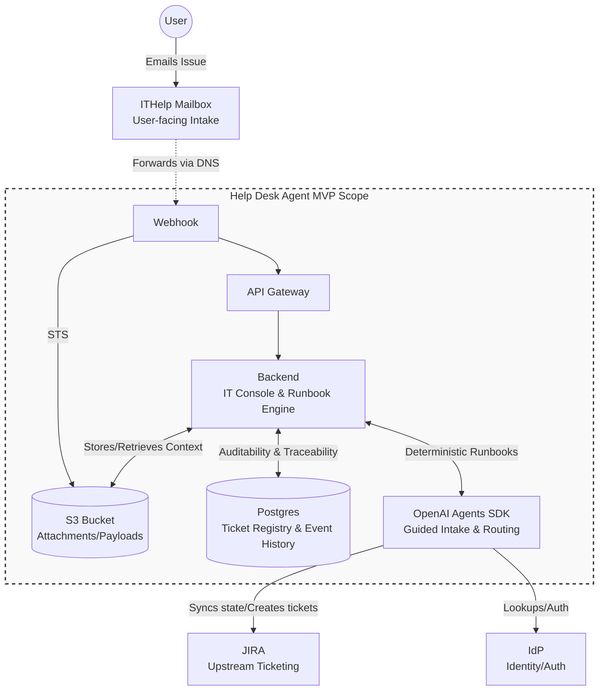

# Roadmap 26-02-2026

## Contexto del caso de uso (Help Desk)

El caso de uso de Help Desk consiste en automatizar el ciclo inicial de gestión de incidencias IT: recibir el ticket del usuario, clasificarlo en la categoría correcta, extraer la información necesaria y proponer (o ejecutar) el flujo de resolución adecuado. El objetivo es reducir trabajo manual en triage y estandarizar la ejecución sobre herramientas corporativas (JIRA, IdP, correo), manteniendo validación humana en los pasos sensibles.

## Preparación y accesos

1. Entender en detalle qué tareas hay que realizar y cómo para el caso de uso seleccionado (objetivo: automatizar, para lo que necesitamos saber exactamente qué hay que hacer).
2. Obtener acceso a JIRA PRE (persona: Nacho, `ignacio.tomas@ext.volotea.com`).
3. Crear un buzón genérico de pruebas (petición ITHelp, `techlab@volotea.com`).
4. Entender cuántos agentes vamos a necesitar y cómo se van a comunicar entre ellos.
5. Tener acceso a la cuenta sandbox.
6. Configurar SES en la cuenta sandbox.

## Correo propuesto a Ignacio Tomás

Puedes enviar este correo:

**Para:** `ignacio.tomas@ext.volotea.com`  
**Asunto:** Solicitud de acceso a JIRA PRE para automatización del caso Help Desk

Hola Ignacio,

Estamos avanzando con el caso de uso de automatización de Help Desk y necesitamos acceso a JIRA PRE para el equipo técnico.

El objetivo de este acceso es poder:
1. Leer y analizar tickets reales en entorno PRE para validar el flujo de clasificación y extracción de datos.
2. Crear/actualizar tickets desde el prototipo para probar la integración end-to-end.
3. Verificar que la propuesta de resolución y el grupo resolutor se registran correctamente en JIRA.

Nos ayudaría contar con permisos sobre los proyectos y tipos de incidencia que se usan en este caso para poder hacer pruebas completas sin bloqueos.

Si necesitas, te compartimos el detalle técnico de endpoints y operaciones que vamos a ejecutar sobre JIRA PRE.

Gracias.

## Objetivo Fase 1

Filtrado, categorizado, información extraída, limpieza y propuesta de solución en ticket JIRA + grupo resolutor.

- Integración con JIRA.

## Objetivo Fase 2

Man in the loop + ejecución automática del ticket.

- Integración con IdP vía Microsoft Graph.

Extras: 

Here is a structured Markdown document designed to sit right next to your diagram. It breaks down the architecture into an actionable implementation plan, keeping your MVP goals and scope constraints in mind.

You can copy and paste this directly into your project wiki, README, or planning document.

---

# Implementation Plan: Help Desk Agent MVP

**Scope:** All changes are isolated to the `help-desk-agent/` directory. This document outlines the practical implementation steps to achieve a deterministic, auditable, and easy-to-evolve IT Help Desk Agent using the OpenAI Agents SDK.

## 1. Component Responsibilities & Implementation Details

### Intake Layer (The "Front Door")

* **ITHelp Mailbox & Webhook:** * *Implementation:* Configure a mail routing service (e.g., AWS SES, SendGrid) to listen to the target mailbox and push incoming email payloads via webhook.
* *Goal:* Abstract away IMAP/SMTP complexities.

* **API Gateway & S3 (Payload Storage):**
* *Implementation:* The webhook hits the API Gateway, triggering a serverless function or lightweight backend route. The raw payload (and any attachments) is immediately dumped into an S3 bucket.
* *Goal:* Ensure absolute traceability. We always have the unmodified ground-truth request before the AI touches it.

### Core Backend & State (The "Brain & Memory")

* **Backend Service (IT Console & Orchestration):**
* *Implementation:* A lightweight service (e.g., Node.js/Express or Python/FastAPI) that handles incoming webhook events, orchestrates the OpenAI SDK, and serves the IT-facing console API.
* *Goal:* Separate the deterministic business logic (routing, saving to DB) from the probabilistic AI logic.

* **Postgres (Ticket Registry & Event History):**
* *Implementation:* Define strict schemas for `Tickets`, `Users`, and `AgentEvents`. Every action the OpenAI Agent takes is logged here.
* *Goal:* Auditability. The IT console reads from this DB to show admins exactly *why* an agent made a decision.

### AI & Integrations (The "Workers")

* **OpenAI Agents SDK:**
* *Implementation:* Configured strictly within the `help-desk-agent/` folder. Define system prompts focused on specific IT runbooks (e.g., "Password Reset", "Software Provisioning").
* *Goal:* Guided intake and routing based on upstream SDK best practices.

* **Tools (JIRA & IdP):**
* *Implementation:* Expose external APIs to the Agent as callable Functions/Tools.
* `IdP Tool`: To look up user roles and verify identity based on the sender's email.
* `Jira Tool`: To search for duplicate tickets, create new tickets, and update statuses.

---

## 2. Phased Implementation Strategy

**Phase 1: Plumbing & Traceability (No AI yet)**

1. Set up the webhook to catch emails.
2. Implement the API Gateway $\rightarrow$ Backend route.
3. Save raw payloads to S3.
4. Write basic event logs to Postgres.

**Phase 2: Basic Agent Integration (The MVP Core)**

1. Integrate the OpenAI Agents SDK in the `help-desk-agent/` folder.
2. Implement the `IdP Lookup` tool so the agent knows *who* is emailing.
3. Implement the `Jira Create Ticket` tool.
4. Write a baseline system prompt: "Read the email, identify the user via IdP, summarize the issue, and create a Jira ticket."

**Phase 3: Deterministic Runbooks & IT Console**

1. Add routing logic: Teach the agent to categorize the ticket (e.g., Hardware, Access, HR) and execute specific runbooks.
2. Build simple API endpoints on the Backend to allow IT staff to query Postgres and view the agent's step-by-step reasoning.
3. Refine prompts based on edge cases found during testing.

---

## 3. Open Design Decisions for the Team

* **Human-in-the-loop (HITL):** For sensitive runbooks (like granting access to financial systems), should the agent draft the Jira ticket and wait for an IT admin to click "Approve" before execution?
* **Thread Management:** When a user replies to an existing email thread, how are we linking that reply back to the active OpenAI Agent thread and the existing Jira ticket? (Suggestion: Embed the Jira ID or a custom Thread ID in the subject line).
* **SDK Updates:** Who owns the process of reviewing upstream OpenAI SDK changes to ensure our implementation remains synced?

---

Would you like me to draft a proposed database schema (for Postgres) to handle the "Ticket registry and event history" requirement next?

## Others

